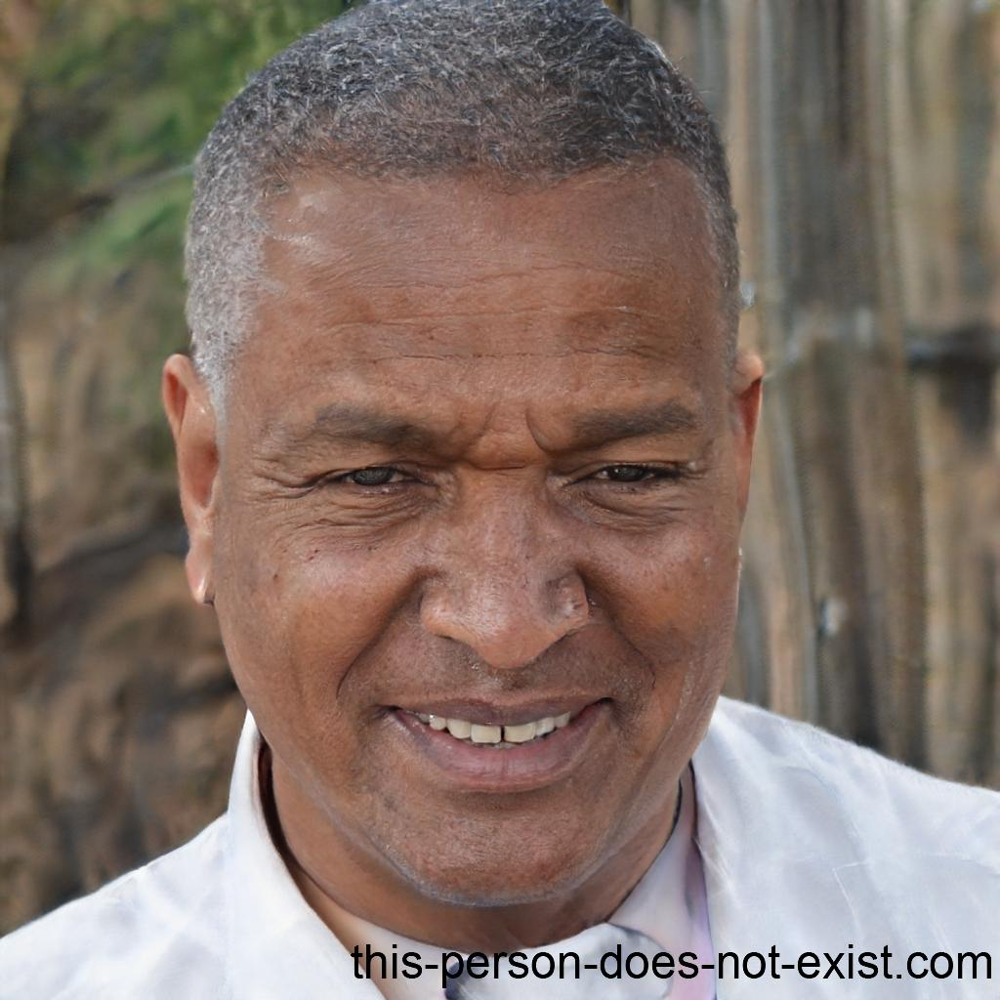

# Personas

## Introdução

Personas são personagens fictícios que representam o cliente ideal de um negócio. Elas são criadas com base em dados reais sobre os clientes-alvo, incluindo seus comportamentos, características demográficas, histórias pessoais, motivações, objetivos, desafios e preocupações. Essas representações ajudam as empresas a entender melhor suas audiências e a adaptar suas estratégias de marketing e produtos para atender às necessidades específicas de cada grupo de clientes.

## Benefícios

Ao criar as personas para o negócio, é possível definir perfis imaginários dos clientes ideais. Isso ajuda a entender melhor quem são eles e o que procuram, quais seus interesses. Com esse conhecimento, é possível criar conteúdos que atendam às necessidades específicas desses perfis, o que torna a jornada de compra mais rápida e eficaz. Em resumo, as personas ajudam a criar conteúdos que atraem e convencem os clientes de forma mais direta e eficiente.

## Metodologia

A metodologia de personas envolve a criação de perfis fictícios baseados em dados reais de usuários. Essas personas representam diferentes tipos de usuários, com detalhes como nome, idade, ocupação, interesses e desafios. Elas são utilizadas ao longo do processo de design para garantir que o produto atenda às necessidades de uma variedade de usuários. Isso inclui a coleta de dados, identificação de padrões, criação das personas, validação, uso durante o design e testes iterativos. Essa abordagem resulta em produtos mais centrados no usuário e melhor experiência do usuário.

## Elenco

<b>Tabela 1</b> - Persona João Silva.

| |
| -- |
| <figure markdown>
Figura 1 - Persona João Silva.

<figcaption>
Fonte: Elaborada por 
| **Nome:** João Silva|
| **Status:** Antipersona |
| **Gênero:** Masculino |
| **Idade:** 55 anos|
| **Profissão:** Engenheiro civil, dono de uma pequena empresa de construção civil em Brasília.|
| **Escolaridade:** Graduado em Engenharia Civil pela Universidade de Brasília (UnB).|
| **Habilidades e Experiências:** João é um engenheiro civil experiente, mas não tem muita familiaridade com tecnologias modernas, pois sua empresa ainda utiliza métodos tradicionais de construção. Passa grande parte do tempo trabalhando em projetos de construção e gerenciando sua equipe.|
| **Relacionamentos:** Pai de um filho, Pedro, de 25 anos, que está cursando Engenharia Elétrica na mesma universidade em que João se formou. Mantém amizades próximas com colegas de profissão e alguns vizinhos.|
| **Objetivo:** João foi orientado por seu filho Pedro a usar o aplicativo gov.br para acessar o serviço de consulta de licenças ambientais para um projeto de construção. Seu objetivo é encontrar o serviço rapidamente, realizar a consulta e depois desinstalar o app, já que não é um usuário frequente de aplicativos do governo.|
| **Expectativa:** João espera que o aplicativo gov.br seja fácil de usar, mesmo para alguém com pouca experiência em smartphones. Ele quer uma forma rápida e segura de encontrar o serviço de consulta de licenças ambientais e obter as informações necessárias para seu projeto. Privacidade e segurança são importantes para ele ao lidar com informações sensíveis.|
| **Requisitos:** Interface simples e intuitiva para facilitar a busca pelo serviço de consulta de licenças ambientais. Processo de consulta rápido e eficiente, com poucos passos. Uma vez que realizou a consulta, deseja uma opção clara para desinstalar o aplicativo, já que não pretende usá-lo novamente tão cedo.|
| **Rotina Diária:** João começa seu dia cedo, revisando planos de construção e se preparando para o trabalho.|
| **Uso do App:** Usou o aplicativo gov.br uma única vez para acessar o serviço de consulta de licenças ambientais para seu projeto. Após obter as informações necessárias, desinstalou o app para manter seu celular limpo de aplicativos não utilizados.|

 

<b>Tabela 2</b> - Persona Maria Fernanda Alves.

| |
| -- |
| <figure markdown>
Figura 2 - Persona Maria Fernanda.

<figcaption>
Fonte: Elaborada por 
|**Nome:** Maria Fernanda Alves|
|**Status:** Persona Primária|
|**Gênero:** Feminino|
|**Idade:** 35 anos|
|**Profissão:** Advogada|
|**Escolaridade:** Graduada em Direito e Pós-Graduada em Direito Tributário.|
|**Habilidades e Experiências:** Especializada em Direito Tributário, trabalha em um escritório renomado em Brasília.Tem habilidades avançadas em pesquisa jurídica e análise de documentos.|
|**Relacionamentos:** Casada e mãe de dois filhos, um menino de 10 anos e uma menina de 7 anos. Membro ativo da comunidade jurídica, participa de eventos e workshops.|
|**Objetivo:** Instalou o app gov.br para acessar serviços relacionados à consulta de processos tributários. Precisa estar sempre atualizada sobre os processos de seus clientes.|
|**Expectativa:** Notificações sobre atualizações nos processos consultados. Navegação rápida e fácil para acessar os documentos necessários.|
|**Requisitos:** Interface intuitiva para busca de processos e documentos. Segurança na transmissão e armazenamento de documentos sensíveis.|
|**Tarefas:** Passa grande parte do dia no escritório, lidando com casos tributários. Procura informações atualizadas sobre leis e regulamentos.|

 

<b>Tabela 3</b> - Persona Secundária Rafael Santos.

| |
| -- |
| <figure markdown>
Figura 3 - Persona Rafael Santos.

<figcaption>
Fonte: Elaborada por 
| **Nome**: Rafael Santos|
| **Status:** Persona Secundária|
| **Gênero:** Masculino|
| **Idade:** 28 anos|
| **Profissão:** Professor de História|
| **Escolaridade:** Licenciatura em História e Mestrado em Educação.|
| **Habilidades e Experiências:** Especializado em História Moderna, dá aulas em uma escola de ensino médio em Brasília. Tem habilidades em pesquisa histórica e métodos de ensino inovadores.|
| **Relacionamentos:** Solteiro e morando sozinho em um apartamento na cidade. Participa de grupos de estudo e discussão online sobre história.|
| **Objetivo:** Instalou o app gov.br para acessar conteúdo educacional e recursos sobre história. Busca materiais para enriquecer suas aulas e aprofundar seus conhecimentos.|
| **Expectativa:** Facilidade em encontrar artigos, vídeos e materiais didáticos sobre história. Notificações sobre novos recursos ou eventos educacionais.|
| **Requisitos:** Interface amigável para busca e navegação de conteúdo educacional. Possibilidade de salvar e organizar materiais para referência futura.|
| **Tarefas:** Passa tempo livre estudando e preparando aulas. Participa de eventos e palestras sobre história sempre que possível.|

 

<b>Tabela 4</b> - Persona Primária Lucas Oliveira.

| |
| -- |
| <figure markdown>
Figura 4 - Persona Lucas Oliveira.

<figcaption>
Fonte: Elaborada por 
|**Nome**: Lucas Oliveira|
|**Status:** Persona Primária|
|**Gênero:** Masculino|
|**Idade:** 25 anos|
|**Profissão:** Desenvolvedor de Jogos Indie|
|**Escolaridade:** Graduado em Design de Jogos pela Universidade de São Paulo (USP)|
|**Habilidades e Experiências:** Desenvolvedor talentoso e criativo de jogos indie. Especializado em design de níveis, programação e arte pixelada. Seu jogo mais recente, "Galactic Quest", recebeu elogios da comunidade gamer.|
|**Relacionamentos:** Membro ativo da comunidade de desenvolvedores de jogos indie. Mantém contato próximo com outros desenvolvedores e fãs de jogos.|
|**Objetivo:** Instalou o app gov.br para acessar financiamentos e subsídios para desenvolvimento de jogos. Busca recursos para financiar seu próximo projeto de jogo, "Cyber Realm".|
|**Expectativa:** Receber notificações sobre novos editais e concursos para desenvolvedores de jogos. Acesso rápido a informações sobre subsídios e programas de financiamento.|
|**Requisitos:** nterface moderna e inspiradora para criativos. Acesso fácil aos detalhes de financiamentos e requisitos para inscrição. Compartilhamento rápido de documentos e portfólio de jogos.|
|**Tarefas:** Passa longas horas no estúdio desenvolvendo seu jogo "Cyber Realm". Participa de game jams e eventos da indústria de jogos. Pesquisa constantemente por oportunidades de financiamento e apoio para seu trabalho.|

 

<b>Tabela 5</b> - Persona Primária Rodrigo Oliveira.

| |
| -- |
| <figure markdown>
Figura 5 - Persona Rodrigo Oliveira.

<figcaption>
Fonte: Elaborada por 
|**Nome:** Dr. Rodrigo Oliveira|
|**Status:** Persona Primária|
|**Gênero:** Masculino|
|**Idade:** 40 anos|
|**Profissão:** Físico e Matemático renomado|
|**Escolaridade:** Doutorado em Física Teórica pela Universidade de Brasília (UnB)|
|**Habilidades e Experiências:** Reconhecido por suas contribuições em física teórica e matemática avançada. Publicou diversos artigos em revistas científicas de renome internacional. Conhecido por suas palestras e participações em conferências ao redor do mundo.|
|**Relacionamentos:** Solteiro, dedica grande parte de seu tempo à pesquisa e ensino.Mantém colaborações com outros pesquisadores de várias partes do mundo.|
|**Objetivo:** Instalou o app gov.br para acessar recursos relacionados a bolsas de pesquisa e financiamentos para seus projetos. Busca estar atualizado sobre oportunidades de pesquisa e eventos científicos.|
|**Expectativa:**Receber notificações sobre novas bolsas de estudo e oportunidades de financiamento.Acesso rápido a documentos científicos e recursos para suas pesquisas.|
|**Requisitos:** Interface intuitiva para navegação eficiente. Segurança na transmissão e armazenamento de documentos e dados de pesquisa sensíveis.|
|**Tarefas:** Passa a maior parte do tempo em seu escritório, trabalhando em equações e teorias complexas. Participa de conferências e workshops para compartilhar seus conhecimentos. Procura constantemente por novas oportunidades de pesquisa e financiamento.|

## Bibliografia
- This Person Does Not Exist. Disponível em: https://this-person-does-not-exist.com/en . Acesso em: 6 de abril de 2024
- Personas. Disponível em: https://www.portalinsights.com.br/perguntas-frequentes/quais-os-beneficios-da-persona. Acesso em: 6 de Abril de 2024

## Histórico de Versão
