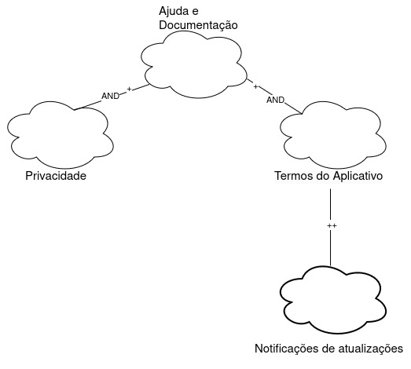

# NFR Framework

## Introdução

O NFR(Non-Functional Requirements) Framework é uma abordagem muito importante no desenvolvimento de software e sistemas, pois é utilizado para selecionar, organizar, analisar e gerenciar requisitos não funcionais em projetos de software. Diferentemente dos requisitos funcionais, que descrevem o que o sistema deve fazer, os requisitos não funcionais descrevem como o sistema deve se comportar, incluindo aspectos como desempenho, segurança, usabilidade, confiabilidade e escalabilidade, e são fundamentais para o sucesso de um sistema de software, especificando os critérios de qualidade que o sistema deve atender, além das funcionalidades básicas. 

O framework utiliza o conceito de softgoal, que defini-se como um objetivo que descreve uma qualidade desejada ou um requisito não funcional do sistema. Diferente dos objetivos funcionais, que têm critérios de satisfação claros e específicos, os softgoals são mais subjetivos e podem não ter uma definição precisa de quando estão totalmente satisfeitos. Os softgoals representam os requisitos não funcionais, e podem estar inter-relacionados, expressando a influência de um softgoal em outro. O Framework também possui um método de análise qualitativa para decidir os status dos softgoals, dado que outros softgoals relacionados foram ou não satisfeitos.

O NFR Framework funciona através da construção e revisão incremental de um Softgoal Interdependency Graph(SIG), ou Gráfico de Interdependência de Softgoals. Este gráfico registra as considerações dos desenvolvedores sobre os softgoals e suas interdependências, armazenando graficamente as decisões de desenvolvimento, incluindo Requisitos Não-Funcionais, alternativas e justificativas. Os SIGs armazenam um registro completo das decisões de desenvolvimento e da lógica do projeto de forma gráfica e concisa.

Os softgoals podem ser divididos em três tipos, sendo eles:

- Softgoals NFR: representam os Requisitos Não-Funcionais e podem estar inter-relacionados, organizados em catálogos e apresentados de forma hierárquica durante o desenvolvimento do projeto.

- Softgoals de Operacionalização: Representam abordagens de implementação para atender aos softgoals NFR ou outros softgoals de operacionalização. Essas abordagens englobam operações, processos, representações de dados, estruturas e restrições no sistema alvo, visando atender às necessidades indicadas pelos softgoals NFR e de operacionalização.

- Softgoals de Afirmação: permitem que as características do domínio, como prioridades e carga de trabalho, sejam consideradas e refletidas no processo de tomada de decisão. Eles justificam a priorização, refinamento e seleção de componentes dos softgoals, facilitando a revisão, a justificação e a mudança do sistema, além de melhorar a rastreabilidade.

O procedimento de avaliação verifica o grau de satisfação dos requisitos não funcionais por um conjunto de decisões, determinando se cada softgoal ou interdependência do SIG foi satisfatoriamente atendido. Para isso, são atribuídos rótulos como "satisfeito", "fracamente satisfeito", "negado", "fracamente negado", "conflitante" e "indeterminado". A análise dos softgoals de nível mais baixo na hierarquia de um SIG envolve decisões sobre aceitar ou negar alternativas no projeto. Essas decisões geram um conjunto inicial de rótulos, que são utilizados pelo procedimento de avaliação para determinar o impacto das decisões nos softgoals em níveis hierárquicos mais altos. Esse processo é repetido até chegar aos softgoals no nível mais alto do SIG.

## Metodologia 

Para a realização desse artefato, foram desenvolvidos 6 NFRs, definidos a partir do artefato especificação suplementar presente neste projeto, que foi baseado no modelo FURPS+. Cada NFR presente neste artefato segue uma categoria do modelo FURPS+.

Para cada NFR foi feito uma tabela de requisitos NF derivada da especificação suplementar, um SIG (Softgoal Interdependency Graph), um diagrama de propagação de impáctos e um cartão de especificação, que possui informações sobre o NFR.

## NFR1 - Confiabilidade 

 Tabela 1 - Requisitos de Confiabilidade 

| Identificador |                                                                Descrição                                                                |
| :-----------: | :-------------------------------------------------------------------------------------------------------------------------------------: |
|     CON01     | O sistema deve ser estável e confiável, funcionando corretamente sem travamentos ou fechamentos inesperados. |
|     CON02     |                                          Confiabilidade: O aplicativo deve manter a integridade dos documentos e informações consultadas.                                           |
|     CON03     |                            O aplicativo deve ser seguro e confiável, protegendo os dados dos usuários.                                         |
|     CON04     |                            O sistema deve notificar os usuários de quaisquer acessos não autorizados ou mudanças críticas na segurança de suas contas.                                   |
|     CON05     |                            Como usuário, desejo garantir a segurança na transmissão e armazenamento de documentos sensíveis.                                   |

Autor(a): <a href="https://github.com/HeBatalha">Henrique Batalha</a>

 

### Sem Propagação

Figura 1: NFR- Confiabilidade Sem Propagação, Autor(a): <a href="https://github.com/HeBatalha">Henrique Batalha</a>

### Com Propagação

Figura 2: NFR- Confiabilidade Com Propagação, Autor(a): <a href="https://github.com/HeBatalha">Henrique Batalha</a>

 

Tabela 2: Cartão de Especificação - Confiabilidade

| Classificação         | Confiabilidade | 
| ----------------------|--|
| Descrição             | A confiabilidade refere-se à capacidade do sistema de desempenhar suas funções esperadas de forma consistente, correta e segura. |
| Justificativa         | Sem essa característica, o usuário não consegue utilizar o software com segurança, obter o suporte necessário e confiar na transparência do sistema.  |
| Origem do requisito   | [CON01, CON02, CON03, CON04, CON05](../modelagem/especificacao_suplementar.md)  | [//]: # (RNF01, RNF20, RNF09, RNF06, RF36)
| Critério de aceitação | Nenhum |
| Prioridade            | Alta prioridade |
| Conflito              | Nenhum |
| História              | 26 de mai. 2024 |

Autor(a): <a href="https://github.com/HeBatalha">Henrique Batalha</a> 

## NFR02- Ajuda e Documentação

Tabela 3 - Requisitos de Ajuda e documentação

| Identificador |                                                                Descrição                                                                |
| :-----------: | :-------------------------------------------------------------------------------------------------------------------------------------: |
|     AD01     | Atualização: O aplicativo deve manter os usuários informados sobre novidades e atualizações importantes. |
|     AD02     | Privacidade: Garantir que as informações dos usuários não sejam compartilhadas sem permissão.                                           |

Autor(a): <a href="https://github.com/Caio-bergbjj">Caio Berg</a>

 

### Sem Propagação

Figura 3: NFR- Ajuda e documentação Sem Propagação, Autor(a): <a href="https://github.com/Caio-bergbjj">Caio Berg</a>

### Com Propagação

Figura 4: NFR- Ajuda e documentação Sem Propagação, Autor(a): <a href="https://github.com/Caio-bergbjj">Caio Berg</a>

 

Tabela 4: Cartão de Especificação - Ajuda e Documentação

| Classificação         | Ajuda e Documentação | 
| ----------------------|--|
| Descrição             | Ajuda e Documentação tratam-se da disponibilidade de material suplementar para o uso do aplicativo. |
| Justificativa         | O aplicativo deve ajudar o usuário na sua utilização, para que a experiência se torne melhor e mais fácil. |
| Origem do requisito   | [AD01, AD02](../modelagem/especificacao_suplementar.md)  | 
| Critério de aceitação | Nenhum |
| Prioridade            | Alta |
| Conflito              | Nenhum |
| História              | 26 de mai. 2024|

 Autor(a): <a href="https://github.com/Caio-bergbjj">Caio Berg</a> 

## NFR03 - Portabilidade

Tabela 5 - Requisitos de Portabilidade.

| Identificador |                                                                Descrição                                                                |
| :-----------: | :-------------------------------------------------------------------------------------------------------------------------------------: |
|     DES01     | As funcionalidades críticas, como reconhecimento facial e autenticação, devem ser otimizadas para operar de maneira rápida e eficiente. |
|     DES02     |                                          O aplicativo deve ter boa performance e ser estável.                                           |
|     DES03     |                            O aplicativo deve ser rápido no acesso e no agendamento de serviços.                                         |
|     DES04     |                            O aplicativo não deve demorar mais que 2 segundos para fazer uma consulta.                                   |

Autor(a): <a href="https://github.com/thiagorfreitas">Thiago Freitas</a> e <a href="https://github.com/ArthurGabrieel">Arthur Gabriel</a>

### Sem Propagação

Figura 5: NFR- Portabilidade Sem Propagação, Autor(a): <a href="https://github.com/thiagorfreitas">Thiago Freitas</a> e <a href="https://github.com/ArthurGabrieel">Arthur Gabriel</a>

### Com Propagação

 

Figura 6: NFR- Portabilidade com Propagação, Autor(a): <a href="https://github.com/thiagorfreitas">Thiago Freitas</a> e <a href="https://github.com/ArthurGabrieel">Arthur Gabriel</a>

 

Tabela 6: Cartão de Especificação - Portabilidade

| Classificação     | Multiplataforma | 
| ----------------------|--|
| Descrição       |O aplicativo deve ser acessível em diferentes plataformas.  |
| Justificativa     | O aplicativo deve ser acessível em diferentes plataformas, incluindo dispositivos móveis (Android e iOS), para atender às necessidades de uma ampla gama de usuários e garantir a flexibilidade de uso. |
| Origem do requisito  | RNF06 e SUP05 |
| Critério de aceitação | Disponibilidade do aplicativo em web, dispositivos móveis (Android, iOS). Interface otimizada para cada plataforma, com recursos e funcionalidades adequados.  |
| Prioridade      | Alta |
| Conflito       | Custo alto |
| Historia       | 26 de maio de 2024 |

| Classificação     | Acesso para usuários com deficiência | 
| ----------------------|--|
| Descrição       | O aplicativo deve ser acessível levando em conta as diferentes necessidades dos usuários |
| Justificativa     | O aplicativo deve ser acessível a usuários com deficiência, incluindo deficiências visuais, auditivas, motoras e cognitivas, para garantir a inclusão e a igualdade de oportunidades. |
| Origem do requisito  | RNF08 e SUP01 |
| Critério de aceitação | Conformidade com as diretrizes de acessibilidade WCAG 2.1 (nível AA). Compatibilidade com softwares de leitura de tela populares (NVDA, JAWS). Navegação por teclado e outras interfaces alternativas. Legendas e descrições de áudio para conteúdo de vídeo e áudio. Layout e cores amigáveis ​​para pessoas com deficiência visual. Suporte a tecnologias assistivas como leitores de tela, braille e teclados adaptados. |
| Prioridade      | Alta |
| Conflito       | Nenhum |
| Historia       | 26 de maio de 2024 |

Autor(a): <a href="https://github.com/thiagorfreitas">Thiago Freitas</a> e <a href="https://github.com/ArthurGabrieel">Arthur Gabriel</a> 

## NFR04 - Desempenho (Performance)

Tabela 7 - Requisitos de Desempenho (Performance).

| Identificador |                                                                                       Descrição                                                                                        |
| :-----------: | :------------------------------------------------------------------------------------------------------------------------------------------------------------------------------------: |
|     SUP01     | O sistema deve ser acessível e disponível para todos os usuários, garantindo acessibilidade para usuários com deficiências e oferecendo suporte a múltiplas plataformas e navegadores. |
|     SUP02     |                                                                  O aplicativo deve ter suporte ao cliente eficiente.                                                                   |
|     SUP03     |                                                    Como usuário, desejo uma navegação intuitiva para buscar processos e documentos.                                                    |
|     SUP04     |                                                     Como usuário, desejo eficiência no agendamento e acompanhamento de processos.                                                      |
|     SUP05     |                                               Como usuário, desejo receber atualizações relevantes sobre processos e benefícios sociais.                                               |
|     SUP05     |                                               Como usuário, desejo ter acesso ao aplicativo tanto no android como no ios.                                                              |

Autor(a): <a href="https://github.com/TheCarlosRamos">Carlos Gabriel</a>

### Sem Propagação

Figura 7: NFR- Desempenho(Performance) Sem Propagação, Autor(a): <a href="https://github.com/TheCarlosRamos">Carlos Gabriel</a>

### Com Propagação

 

Figura 8: NFR- Desempenho (Performance) com Propagação, Autor(a): <a href="https://github.com/TheCarlosRamos">Carlos Gabriel</a>

 

Tabela 8: Cartão de Especificação - Desempenho (Performance)

| Classificação     | Estabilidade e desempenho | 
| ----------------------|--|
| Descrição       | O aplicativo deve atneder ás necessidades dos usuários de forma eficiênte e estável |
| Justificativa     | O aplicativo deve estar disponível para uso a maior parte do tempo para atender às necessidades dos usuários e garantir a confiabilidade do sistema. |
| Origem do requisito  | RNF03, RNF14, RNF18, DES01, DES02 e DES04 |
| Critério de aceitação | Disponibilidade de 99,9%. Implementação de redundância de servidores e mecanismos de failover. Monitoramento constante do sistema para detectar e corrigir problemas rapidamente. Implementação de mecanismos de auto-recuperação para lidar com falhas de hardware e software. Minimização do tempo de inatividade em caso de falhas. Processos de backup e restauração de dados confiáveis. Clique em botões e navegação na interface com resposta instantânea. Tempo de espera inferior a 2 segundo para ações comuns. |
| Prioridade      | Alta |
| Conflito       | Nenhum |
| Historia       | 26 de maio de 2024 |

| Classificação     | Eficiência no acesso e agendamento | 
| ----------------------|--|
| Descrição       | O aplicativo deve ser eficiênte, intuitivo e rápido para acessar e agendar serviços |
| Justificativa     | O aplicativo deve carregar dados e telas rapidamente para minimizar o tempo de espera do usuário e otimizar a produtividade. |
| Origem do requisito  | SUP04 e DES03 |
| Critério de aceitação |  Tempo de carregamento de telas em menos de 3 segundos em redes 3G/4G. Tempo de espera inferior a 2 segundos para carregamento de dados. Função de pesquisa com opções de filtragem e autocompletar. Resultados de pesquisa relevantes e organizados de forma lógica. Integração com mecanismos de busca externos (Google, Bing). Sincronização automática em segundo plano. Resolução de conflitos de dados em caso de alterações simultâneas em diferentes dispositivos.|
| Prioridade      | Alta |
| Conflito       | Nenhum |
| Historia       | 26 de maio de 2024 |

Autor(a): <a href="https://github.com/TheCarlosRamos">Carlos Gabriel</a> 

## NFR05 - Usabilidade

Tabela 9 - Requisitos de Usabilidade.

|  ID   |                                                           Descrição                                                            |
| :---: | :----------------------------------------------------------------------------------------------------------------------------: |
| USA01 | A interface do sistema deve ser clara e fácil de usar, evitando complexidades desnecessárias que possam confundir os usuários. |
| USA02 |                            Usabilidade: A interface do aplicativo deve ser simples e fácil de usar.                            |
| USA03 |                                        O aplicativo deve ser intuitivo e fácil de usar.                                        |
| USA04 |                         Como usuário, desejo acessar o aplicativo gov.br de forma rápida e intuitiva.                          |
| USA05 |                     Como usuário, desejo encontrar facilmente o serviço de agendamento na Receita Federal.                     |
| USA06 |            Como usuário, desejo acessar as funções de assinatura digital para agilizar a assinatura de documentos.             |

Autor(a): <a href="https://github.com/IsaqueSH">Isaque Santos</a>

 

### Sem Propagação

Figura 9: NFR- Usabilidade Sem Propagação, Autor(a): <a href="https://github.com/IsaqueSH">Isaque Santos</a>

### Com Propagação

 

Figura 10: NFR- Usabilidade com Propagação, Autor(a): <a href="https://github.com/IsaqueSH">Isaque Santos</a>

 

Tabela 10: Cartão de Especificação - Usabilidade.

| Classificação     | Satisfação do usuário | 
| ----------------------|--|
| Descrição       | A Satisfação do Usuário se refere à experiência geral positiva que um usuário tem ao utilizar um sistema. |
| Justificativa     | A Satisfação do Usuário é fundamental para o sucesso de qualquer sistema aumentando a fidelidade, reputação e reduzindo o custo |
| Origem do requisito  | USA04, USA05, USA06 |
| Critério de aceitação | Uma porcentagem significativa dos usuários deve expressar satisfação com o sistema através de pesquisas, avaliações ou feedback direto A quantidade de feedback positivo deve superar significativamente o feedback negativo Uma porcentagem significativa dos usuários deve recomendar o sistema para outras pessoas. |
| Prioridade      | Alta |
| Conflito       | Nenhum |
| Historia       | 26 de maio de 2024 |

| Classificação     |  Facilidade de Uso  | 
| ----------------------|--|
| Descrição       | A Facilidade de Uso se refere à facilidade com que os usuários podem aprender, usar e entender um sistema. |
| Justificativa     | A Facilidade de Uso é crucial para a adoção e o sucesso de um sistema reduzindo a necessidade de treinamento, a frustração e aumentando a produtividade |
| Origem do requisito  | USA01, USA02, USA03 |
| Critério de aceitação | Tempo de Aprendizagem Taxa de Erro Satisfação com a Interface Tempo de Tarefa
Facilidade de Encontrar Ajuda:  |
| Prioridade      | Alta |
| Conflito       | Nenhum |
| Historia       | 26 de maio de 2024 |

Autor(a): <a href="https://github.com/IsaqueSH">Isaque Santos</a>

 

## NFR06 - Restrição de Design

Tabela 11 - Requisitos de Restrição de Design.

| Identificador |                                                        Descrição                                                        |
| :-----------: | :---------------------------------------------------------------------------------------------------------------------: |
|     RD01      |                O sistema deve implementar múltiplos níveis de segurança de acesso (bronze, prata, ouro).                |
|     RD02      |     O aplicativo deve exigir que a senha do usuário possua obrigatoriamente letras, números e caracteres especiais.     |
|     RD03      | O aplicativo deve permitir que os usuários se autentiquem de forma segura, usando credenciais únicas, como CPF e senha. |

Autor(a): <a href="https://github.com/esteerlino">Ester Lino</a>

### Sem Propagação

Figura 11: NFR- Restrição e Design Sem Propagação, Autor(a): <a href="https://github.com/esteerlino">Ester Lino</a>

### Com Propagação

 

Figura 12: NFR- Restrição e Design com Propagação, Autor(a): <a href="https://github.com/esteerlino">Ester Lino</a>

 

Tabela 12: Cartão de Especificação - Restrição e Design.

| Classificação     | Níveis de Segurança de Acesso | 
| ----------------------|--|
| Descrição       | Os Níveis de Segurança de Acesso se referem à implementação de diferentes níveis de acesso ao sistema, com base nas necessidades e responsabilidades dos usuários. |
| Justificativa     | A implementação de Níveis de Segurança de Acesso é crucial para proteger dados sensíveis, minimizar o risco de ataques e cumprir regulamentações |
| Origem do requisito  | RD01 |
| Critério de aceitação | Definição de Níveis de Acesso Claros: Os diferentes níveis de acesso devem ser claramente definidos e documentados. Implementação de Mecanismos de Autenticação Robustos: Os mecanismos de autenticação devem ser fortes e eficazes para impedir acessos não autorizados. Controle de Acesso Granular: O sistema deve permitir o controle de acesso granular, permitindo que diferentes permissões sejam definidas para cada nível de acesso. Monitoramento de Acessos: O sistema deve monitorar os acessos e gerar alertas em caso de atividades suspeitas. |
| Prioridade      | Alta |
| Conflito       | Nenhum |
| Historia       | 26 de maio de 2024 |

| Classificação     | Autenticação Segura | 
| ----------------------|--|
| Descrição       | A Autenticação Segura se refere ao processo de verificação da identidade do usuário antes de conceder acesso ao sistema. |
| Justificativa     | A implementação de Autenticação Segura é crucial para proteger contas de usuário, minimizar o risco de ataques e cumprir regulamentações |
| Origem do requisito  | RD03 |
| Critério de aceitação | Força das Senhas Disponibilidade de MFA(multifator) Segurança do Armazenamento de Credenciais Resistência a Ataques de Força Bruta Monitoramento de Tentativas de Login Suspeitas |
| Prioridade      | Alta |
| Conflito       | Nenhum |
| Historia       | 26 de maio de 2024 |

| Classificação     |  Requisitos de Senha | 
| ----------------------|--|
| Descrição       | Os Requisitos de Senha se referem às políticas e regras que o sistema impõe para a criação e uso de senhas pelos usuários. |
| Justificativa     | A implementação de Requisitos de Senha é crucial para: Aumentar a Força das Senhas: Dificultar que hackers adivinhem ou forcem senhas fracas. Melhorar a Segurança Geral: Reduzir o risco de acessos não autorizados ao sistema causados por senhas fracas. Cumprir Regulamentações: Atender às leis e regulamentações de segurança de dados, como a LGPD no Brasil. |
| Origem do requisito  | RD02 |
| Critério de aceitação | Definição de Requisitos de Senha Claros Força das Senhas Verificada Armazenamento Seguro das Senhas Políticas de Troca de Senha Educação e Sensibilização dos Usuários:  |
| Prioridade      | Alta |
| Conflito       | Nenhum |
| Historia       | 26 de maio de 2024 |

Autor(a): <a href="https://github.com/esteerlino">Ester Lino</a>

## Bibliografia

-  SILVA, Reinaldo Antônio da. NFR4ES: Um Catálogo de Requisitos Não-Funcionais para Sistemas Embarcados. Universidade Federal de Pernambuco, 2019. Disponível em: https://aprender3.unb.br/pluginfile.php/2845051/mod_resource/content/2/DISSERTA%C3%87%C3%83O%20Reinaldo%20Ant%C3%B4nio%20da%20Silva.pdf. Acesso em: 26 de maio de 2024.

## Histórico de Versão

| Versão |    Data    |                      Descrição                      |      Autor(es)      | Revisor(es)  |
| :----: | :--------: | :-------------------------------------------------: | :-----------------: | :----------: |
|  1.0  | 26/05/2024 | Versão Inicial  | [Carlos Gabriel](https://github.com/TheCarlosRamos), [Henrique Batalha](https://github.com/HeBatalha) e [Isaque Santos](https://github.com/IsaqueSH) | [Ester Lino](https://github.com/esteerlino) |
|  1.1  | 27/05/2024 | Atualização do NFR framework  | [Carlos Gabriel](https://github.com/TheCarlosRamos), [Henrique Batalha](https://github.com/HeBatalha) e [Isaque Santos](https://github.com/IsaqueSH) | [Ester Lino](https://github.com/esteerlino) |
|  1.2  | 27/05/2024 | Atualização do NFR framework  | [Arthur Gabriel](ArthurGabrieel), [Caio Berg](https://github.com/Caio-bergbjj), [Carlos Gabriel](https://github.com/TheCarlosRamos), [Ester Lino](https://github.com/esteerlino), [Henrique Batalha](https://github.com/HeBatalha), [Isaque Santos](https://github.com/IsaqueSH), [Thiago Freitas](https://github.com/thiagorfreitas) | [Henrique Batalha](https://github.com/HeBatalha) |
