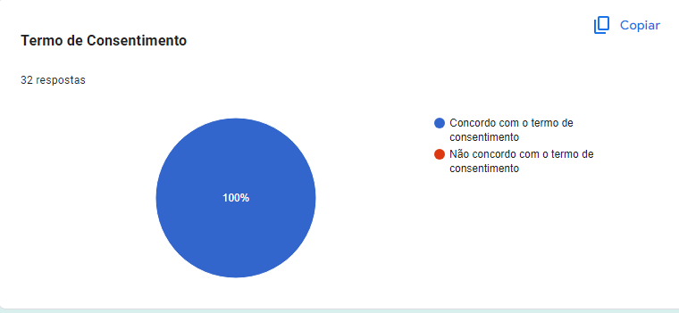
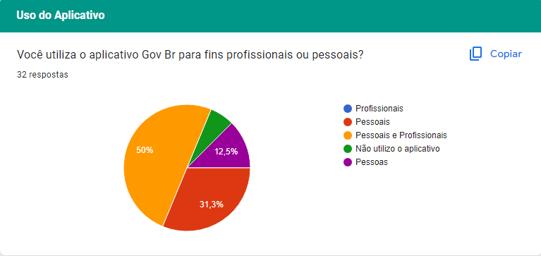
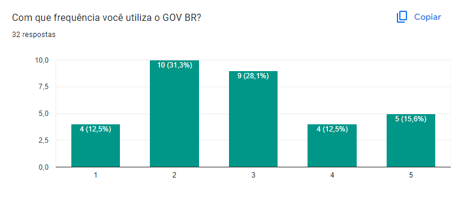
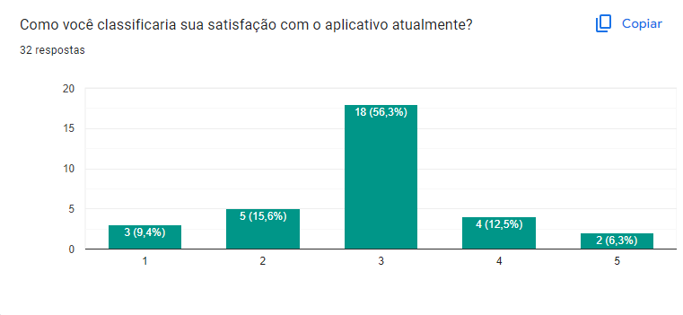
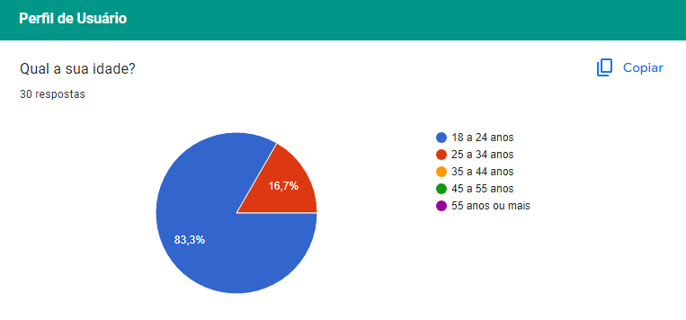
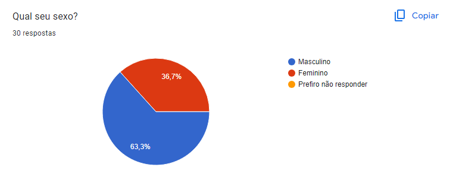
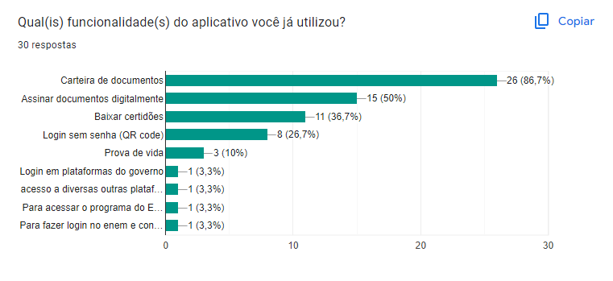
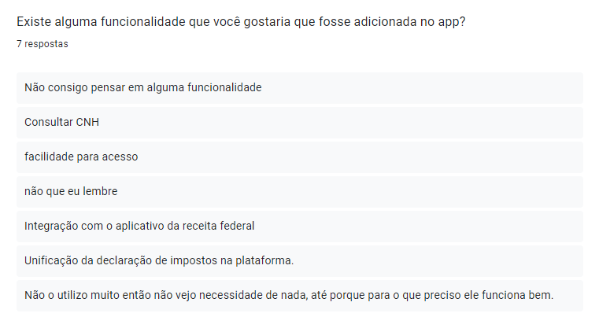
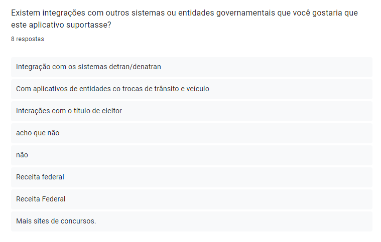

# Perfil de Usuário

## Introdução

O perfil de usuário do aplicativo gov.br é essencial para compreendermos quem são os indivíduos que utilizam esta plataforma governamental. Este perfil visa fornecer uma representação detalhada das características, preferências, comportamentos e necessidades dos usuários do aplicativo gov.br. Ao compreendermos melhor os usuários, podemos aprimorar a experiência oferecida por meio desta aplicação, garantindo que atenda eficazmente às demandas e expectativas da comunidade.

## Objetivo

O Perfil do Usuário do Gov.br é como uma bússola que nos guia na jornada de desenvolvimento da plataforma. Ele mapeia as características, necessidades e comportamentos do nosso público, revelando quem são as pessoas que o Gov.br impacta e como podemos melhorar suas experiências.

## Metodologia

A metodologia de elaboração e definição do perfil de usuário do aplicativo "Gov Br" foi cuidadosamente estruturada ao redor de duas principais abordagens: a aplicação de Questionários e a Análise de Feedback dos Usuários. Esta combinação de métodos quantitativos e qualitativos foi escolhida para garantir uma compreensão abrangente e precisa das necessidades, preferências e comportamentos dos usuários do aplicativo.

## Questionário

### Termo de Consentimento

### Perguntas

### Uso do Aplicativo

#### Pergunta 1

#### Pergunta 2

#### Pergunta 3

### Perfil de Usuário

#### Pergunta 4

#### Pergunta 5

#### Pergunta 6

#### Pergunta 7

#### Pergunta 8

## Definição do Perfil de Usuário

Após uma análise das respostas obtidas pelo questionário juntamente com a análise documental, foi traçado um Perfil de Usuário para o aplicativo do Gov.br com as seguintes descrições:

- **Gênero:** Em sua maioria Masculino.
- **Idade:** acima de 18 anos.
- **Experiência:** Variável, desde iniciantes até experientes em tecnologia.
- **Atitudes:** Tecnófilos.
- **Tarefas primárias:** Acessar serviços como consulta de documentos, assinar documentos digitalmente, baixar certidões, etc.

## Bibliografia

> BARBOSA, S. D. J.; SILVA, B. S. Interação Humano-Computador. Rio de Janeiro: Elsevier, 2011.

> HENRIQUE, Matheus. FERREIRA, Rafael. Perfil do Usuário. Repositório da disciplina de Requisitos de Software da Universidade de Brasília, 1/2023. Disponível em: [https://requisitos-de-software.github.io/2023.1-BilheteriaDigital/elicitacao/perfil_de_usuario/](https://requisitos-de-software.github.io/2023.1-BilheteriaDigital/elicitacao/perfil_de_usuario/). Acesso em: 09 de abril de 2024.

## 📑 Histórico de versões:

| Versão |    Data    | Descrição                                |                                                 Autor(es)                                                 |                 Revisor(es)                  |
| :----: | :--------: | :--------------------------------------- | :-------------------------------------------------------------------------------------------------------: | :------------------------------------------: |
| `1.0`  | 09/04/2024 | Criação do Perfil de Usuário             | [Arthur Gabriel](https://github.com/ArthurGabrieel) e [Thiago Ribeiro](https://github.com/thiagorfreitas) | [Caio Berg](https://github.com/Caio-bergbjj) |
| `2.0`  | 09/04/2024 | Adição dos dados obtidos no Questionário | [Arthur Gabriel](https://github.com/ArthurGabrieel) e [Thiago Ribeiro](https://github.com/thiagorfreitas) | [Caio Berg](https://github.com/Caio-bergbjj) |
