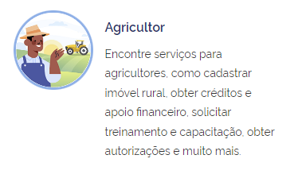
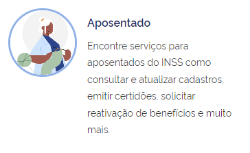
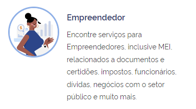
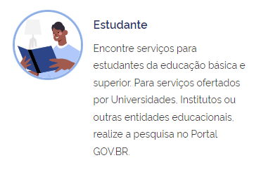
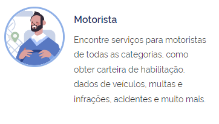
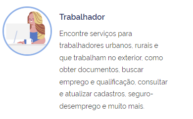
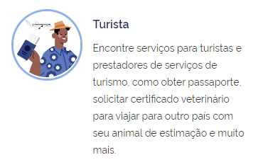

# Perfil de Usuário

## Introdução

O perfil de usuário do aplicativo gov.br é essencial para compreendermos quem são os indivíduos que utilizam esta plataforma governamental. Este perfil visa fornecer uma representação detalhada das características, preferências, comportamentos e necessidades dos usuários do aplicativo gov.br. Ao compreendermos melhor os usuários, podemos aprimorar a experiência oferecida por meio desta aplicação, garantindo que atenda eficazmente às demandas e expectativas da comunidade.

## Objetivo

O Perfil do Usuário do Gov.br é como uma bússola que nos guia na jornada de desenvolvimento da plataforma. Ele mapeia as características, necessidades e comportamentos do nosso público, revelando quem são as pessoas que o Gov.br impacta e como podemos melhorar suas experiências.

## Metodologia

A metodologia de elaboração e definição do perfil de usuário do aplicativo "Gov Br" foi cuidadosamente estruturada ao redor de duas principais abordagens: a aplicação de Questionários e a Análise de Feedback dos Usuários. Esta combinação de métodos quantitativos e qualitativos foi escolhida para garantir uma compreensão abrangente e precisa das necessidades, preferências e comportamentos dos usuários do aplicativo.

Além disso também foi utilizado como base a página [Meu Perfil de Usuário](https://www.gov.br/pt-br/perfil_usuario/todos_os_perfis), do próprio site do GovBR, que contem as informações das funcionalidades mais utilizadas baseadas em cada perfil de usuário.

## Questionário

O questionário foi elaborado com o intuito de coletar informações relevantes sobre os usuários do aplicativo Gov.br. As perguntas foram cuidadosamente elaboradas para abordar aspectos como gênero, idade, experiência com tecnologia, atitudes em relação à tecnologia e tarefas primárias realizadas no aplicativo. A coleta de dados por meio do questionário foi realizada de forma online, garantindo a participação de um número significativo de usuários.

Período do Questionário: 09/04/2024 a 16/04/2024.

### Termo de Consentimento

### Perguntas

### Uso do Aplicativo

#### Pergunta 1

#### Pergunta 2

#### Pergunta 3

### Perfil de Usuário

#### Pergunta 4

#### Pergunta 5

#### Pergunta 6

#### Pergunta 7

#### Pergunta 8

## Definição do Perfil de Usuário

Após uma análise das respostas obtidas pelo questionário juntamente com a análise documental, foi traçado um Perfil de Usuário para o aplicativo do Gov.br com

### Perfil de Usuário

#### Pergunta 4

#### Pergunta 5

#### Pergunta 6

#### Pergunta 7

#### Pergunta 8

## Análise do Documento de Perfis de Usuário

Após uma análise do documento oficial do GovBR, também foram levantados outros perfis de usuários e também as funcionalidades mais utilizadas por cada perfil.

### Agricultor

O perfil de usuário Agricultor no portal Gov.br oferece diversos serviços e informações destinados a agricultores. Esses serviços incluem o cadastro e atualização de imóveis rurais, obtenção de créditos e apoios financeiros, treinamentos e capacitações, autorizações ambientais e registros de produção. Há também serviços relacionados à inovação tecnológica, armazenamento de grãos, produção de sementes e mudas, além de facilidades para cooperativas agrícolas. O objetivo é proporcionar suporte abrangente para as atividades agrícolas, melhorando a gestão e a produtividade no campo.

Para mais detalhes, visite [Gov.br - Agricultor](https://www.gov.br/pt-br/perfil_usuario/agricultor).

### Aposentado

O perfil de usuário Aposentado no portal Gov.br oferece diversos serviços e informações destinados a pessoas aposentadas. Esses serviços incluem a consulta e atualização de benefícios previdenciários, solicitação de aposentadoria, agendamento de perícia médica, acesso a informações sobre direitos e deveres dos aposentados, entre outros. O objetivo é fornecer suporte e facilitar o acesso a recursos e serviços relevantes para essa parcela da população.

Para mais detalhes, visite [Gov.br - Aposentado](https://www.gov.br/pt-br/perfil_usuario/aposentado).

### Empreendedor

O perfil de usuário Empreendedor no portal Gov.br oferece diversos serviços e informações destinados a empreendedores. Esses serviços incluem a abertura e regularização de empresas, obtenção de licenças e alvarás, acesso a linhas de crédito e financiamento, capacitação e treinamentos para empreendedores, entre outros. O objetivo é fornecer suporte e facilitar o processo de empreendedorismo, estimulando o desenvolvimento de negócios e a geração de empregos.

Para mais detalhes, visite [Gov.br - Empreendedor](https://www.gov.br/pt-br/perfil_usuario/empreendedor).

### Estudante

O perfil de usuário Estudante no portal Gov.br oferece diversos serviços e informações destinados a estudantes. Esses serviços incluem acesso a bolsas de estudo, programas de intercâmbio, inscrição em cursos e capacitações, acesso a materiais educacionais, informações sobre programas governamentais de apoio à educação, entre outros. O objetivo é fornecer suporte e facilitar o acesso a recursos e serviços relevantes para estudantes em diferentes níveis de ensino.

Para mais detalhes, visite [Gov.br - Estudante](https://www.gov.br/pt-br/perfil_usuario/estudante).

### Motorista

O perfil de usuário Motorista no portal Gov.br oferece diversos serviços e informações destinados a motoristas. Esses serviços incluem a renovação e consulta da carteira de motorista, agendamento de exames e provas, acesso a informações sobre multas e infrações de trânsito, solicitação de recursos e defesas administrativas, entre outros. O objetivo é fornecer suporte e facilitar o acesso a recursos e serviços relevantes para motoristas, contribuindo para a segurança e a regularização do trânsito.

Para mais detalhes, visite [Gov.br - Motorista](https://www.gov.br/pt-br/perfil_usuario/motorista).

### Trabalhador

O perfil de usuário Trabalhador no portal Gov.br oferece diversos serviços e informações destinados a trabalhadores. Esses serviços incluem acesso a informações sobre direitos trabalhistas, consulta de benefícios sociais, solicitação de seguro-desemprego, acesso a programas de capacitação e qualificação profissional, entre outros. O objetivo é fornecer suporte e facilitar o acesso a recursos e serviços relevantes para trabalhadores, contribuindo para a melhoria das condições de trabalho e empregabilidade.

Para mais detalhes, visite [Gov.br - Trabalhador](https://www.gov.br/pt-br/perfil_usuario/trabalhador).

### Turista

O perfil de usuário Turista no portal Gov.br oferece diversos serviços e informações destinados a turistas. Esses serviços incluem informações sobre destinos turísticos, guias de viagem, informações sobre hospedagem e transporte, acesso a eventos e atrações turísticas, entre outros. O objetivo é fornecer suporte e facilitar a experiência de viagem dos turistas, promovendo o turismo nacional e contribuindo para o desenvolvimento econômico do setor.

Para mais detalhes, visite [Gov.br - Turista](https://www.gov.br/pt-br/perfil_usuario/turista).
## Definição do Perfil de Usuário

Após uma análise das respostas obtidas pelo questionário juntamente com a análise documental, foi traçado um Perfil de Usuário para o aplicativo do Gov.br com as seguintes descrições:

- **Gênero:** Em sua maioria Masculino.
- **Idade:** acima de 18 anos.
- **Experiência:** Variável, desde iniciantes até experientes em tecnologia.
- **Atitudes:** Tecnófilos.
- **Tarefas primárias:** Acessar serviços como consulta de documentos, assinar documentos digitalmente, baixar certidões, etc.

## Bibliografia

> BARBOSA, S. D. J.; SILVA, B. S. Interação Humano-Computador. Rio de Janeiro: Elsevier, 2011.

> HENRIQUE, Matheus. FERREIRA, Rafael. Perfil do Usuário. Repositório da disciplina de Requisitos de Software da Universidade de Brasília, 1/2023. Disponível em: [https://requisitos-de-software.github.io/2023.1-BilheteriaDigital/elicitacao/perfil_de_usuario/](https://requisitos-de-software.github.io/2023.1-BilheteriaDigital/elicitacao/perfil_de_usuario/). Acesso em: 09 de abril de 2024.

> Meu Perfil de Usuário, GovBR.
Disponível em: [https://www.gov.br/pt-br/perfil_usuario/todos_os_perfis](https://www.gov.br/pt-br/perfil_usuario/todos_os_perfis). Acesso em 20 de maio de 2024.

## 📑 Histórico de versões:

| Versão |    Data    | Descrição                                |                                                 Autor(es)                                                 |                     Revisor(es)                     |
| :----: | :--------: | :--------------------------------------- | :-------------------------------------------------------------------------------------------------------: | :-------------------------------------------------: |
| `1.0`  | 09/04/2024 | Criação do Perfil de Usuário             | [Arthur Gabriel](https://github.com/ArthurGabrieel) e [Thiago Ribeiro](https://github.com/thiagorfreitas) |    [Caio Berg](https://github.com/Caio-bergbjj)     |
| `1.1`  | 22/04/2024 | Adição dos dados obtidos no Questionário | [Arthur Gabriel](https://github.com/ArthurGabrieel) e [Thiago Ribeiro](https://github.com/thiagorfreitas) |    [Caio Berg](https://github.com/Caio-bergbjj)     |
| `2.0`  | 20/05/2024 | Correção Pós-Feedback                    |                            [Thiago Ribeiro](https://github.com/thiagorfreitas)                            | [Arthur Gabriel](https://github.com/ArthurGabrieel) |
