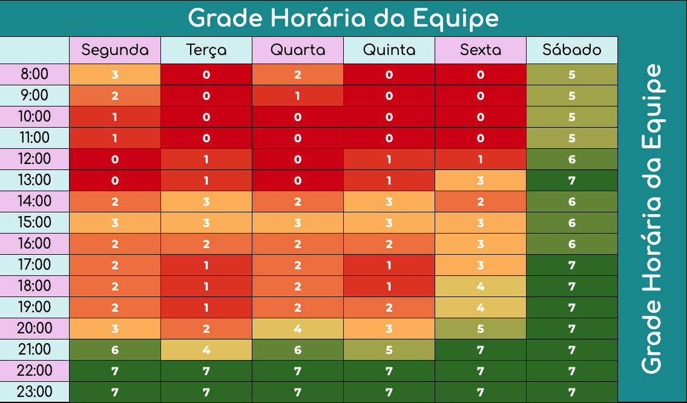

# Heatmap de quadro de Disponibilidade

## Introdução

Para tornar a organização de encontros mais eficaz e assegurar a presença de todos, o mapa de calor indica os horários mais apropriados para a equipe inteira. Utilizando esta informação, elabora-se um cronograma que respeita a disponibilidade individual. Cada membro da equipe preencheu o mapa de calor com seus períodos disponíveis, e os momentos com maior concordância de disponibilidade são realçados.

### Imagem do Heatmap

    
 <b>Imagem 1</b>: Heatmap (Fonte: <a href="https://docs.google.com/spreadsheets/d/18x7fVbhmQgqn2IBiD1d189aWQzAnwEHO/edit?pli=1#gid=1837127671">Excell</a>)
 

### Resultados da Análise de Disponibilidade

Com base na avaliação do Heatmap, identificamos os seguintes horários como os mais adequados para as reuniões do Grupo 4:

- **Segunda-feira**: 22:00 - 23:00
- **Terça-feira**: 22:00 - 23:00
- **Quarta-feira**: 22:00 - 23:00
- **Quinta-feira**: 22:00 - 23:00
- **Sexta-feira**: 21:00 - 23:00

### Histórico de Versões

| Versão | Data | Descrição | Responsáveis | Revisor |
| :----: | :--: | :-----------------------------------------------------: | :----------------------------------------------------------------------------------------------: | :----------------------------------------------: |
|  1.0   | 31/03/2024 | Planejamento Heatmap | [Caio Berg](https://github.com/Caio-bergbjj) | [Arthur Gabriel](https://github.com/ArthurGabrieel) |